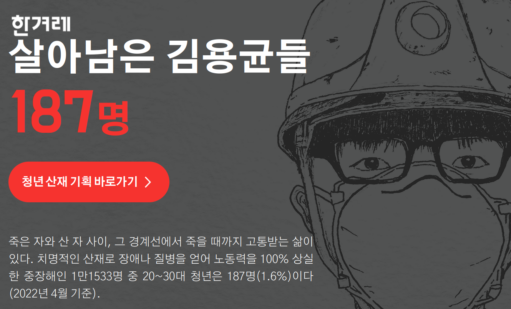
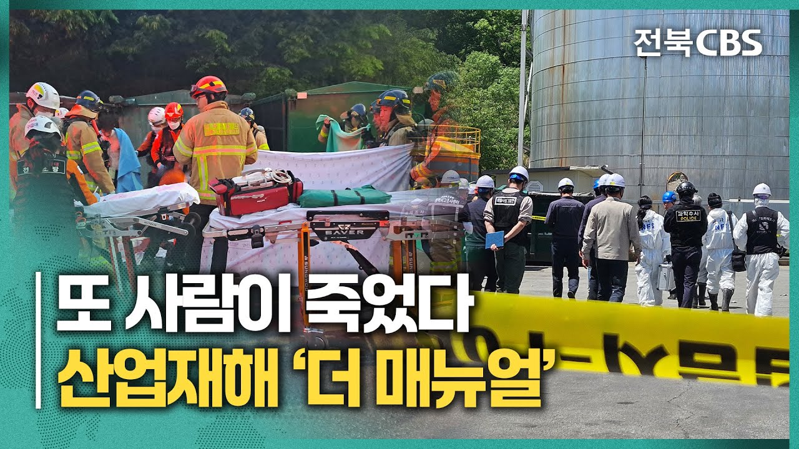
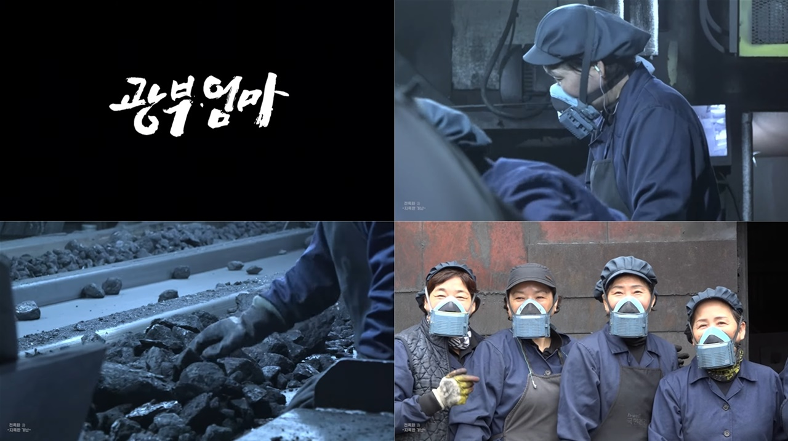

                

                <h2>좋은 산재보도를 추천합니다</h2>
                
이시현

                

                    산재보도는 사고의 결과만 전하는 데서 멈추지 않아야 한다.
                    노동자의 일상적인 작업 환경과 위험의 구조를 함께 비춰야
                    산업재해의 본질이 드러난다. 또한 사고 직후의 충격뿐 아니라
                    치료와 생계, 관계의 변화처럼 재해 이후 이어지는 삶의
                    시간까지 추적할 필요가 있다. 이런 맥락이 더해질 때 산재는
                    개인의 불운이 아니라 사회가 함께 해결해야 할 구조적 문제로
                    읽힌다. 아래에서는 이러한 문제의식을 충실히 담아낸 기획보도
                    세 가지를 소개한다.
                

            

            

                <article class="article-card">
                    <header class="article-card-header">
                        <h3 class="article-copy-title">살아남은 김용균들</h3>
                        
한겨레

                    </header>
                    

                        <figure class="article-hero media-figure crop-center">
                            
                            <figcaption
                                class="article-hero-overlay"
                            ></figcaption>
                        </figure>
                        

                            

                                

                                    

                                        태안 화력발전소에서 일하던 청년 노동자
                                        고 김용균의 안타까운 죽음은 산업재해
                                        문제를 방치해 온 우리 사회에 경종을
                                        울렸다.
                                    

                                    

                                        한겨레는 고 김용균과 같이 산재를 당한
                                        뒤, 살아남은 청년 산재 피해자들의
                                        목소리에 집중했다. 기획보도 '살아남은
                                        김용균들'은 187명의 산재 피해 중장해인
                                        청년들의 사례를 분석하고, 4명의 피해자를
                                        직접 찾아 단순한 수치로 드러나지 않는
                                        산재 '그 이후의 삶'을 조명한다.
                                    

                                

                                <aside class="article-qr">
                                    

                                        
                                        
바로가기

                                    

                                </aside>
                            

                        

                    

                </article>

                

                <article class="article-card">
                    <header class="article-card-header">
                        <h3 class="article-copy-title">
                            더 매뉴얼: 전북 산업재해 톺아보기
                        </h3>
                        
CBS 전북

                    </header>
                    

                        <figure class="article-hero media-figure crop-top">
                            
                            <figcaption
                                class="article-hero-overlay"
                            ></figcaption>
                        </figure>
                        

                            

                                

                                    

                                        언론이 어렴풋이 그려지는 어딘가의 현장이
                                        아니라, 내가 사는 곳 인근에서 내 이웃이
                                        일할 수도 있는 현장의 산업재해를
                                        조명하는 것은 산업재해를 더욱 가까운
                                        일로 느껴지게 한다.
                                    

                                    

                                        지역의 산업재해 현장을 취재한 '더
                                        매뉴얼: 전북 산업재해 톺아보기'는 이러한
                                        감정적 효과를 낼 뿐 아니라, 전문가를
                                        통해 구조적 원인을 파악하고 매뉴얼을
                                        제시하며 더욱 구체적으로 산업재해의
                                        예방을 돕는다.
                                    

                                

                                <aside class="article-qr">
                                    

                                        
                                        
바로가기

                                    

                                </aside>
                            

                        

                    

                </article>

                <article class="article-card">
                    <header class="article-card-header">
                        <h3 class="article-copy-title">광부엄마</h3>
                        
강원일보

                    </header>
                    

                        <figure class="article-hero media-figure crop-bottom">
                            
                            <figcaption
                                class="article-hero-overlay"
                            ></figcaption>
                        </figure>
                        

                            

                                

                                    

                                        '광부엄마'는 탄광에서 일하는 여성
                                        노동자들의 삶을 조명했다. 광부로 일하게
                                        된 계기와, 광부 일로 얻은 진폐증 등
                                        그들의 삶은 산업재해와 떼어놓고 생각하기
                                        어렵다.
                                    

                                    

                                        11편의 연속 보도는 산업재해 외에도
                                        현장에서 맞닥뜨리는 어려움과 그에 맞서는
                                        여성 노동자의 삶과 노동을 세세히
                                        그려내며, 우리가 잘 몰랐던 탄광의 노동에
                                        대한 관심을 환기하고 노동자 중심의
                                        서사를 구성한다.
                                    

                                

                                <aside class="article-qr">
                                    

                                        
                                        
바로가기

                                    

                                </aside>
                            

                        

                    

                </article>
            

