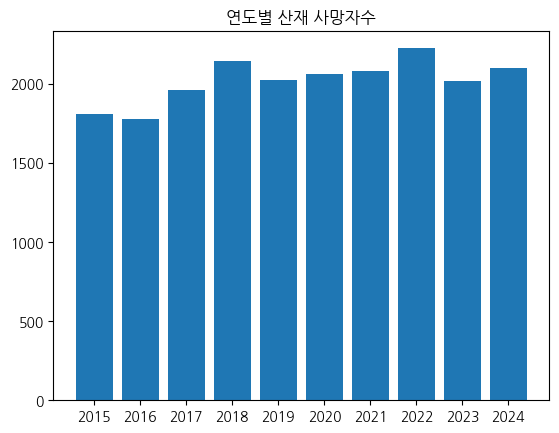
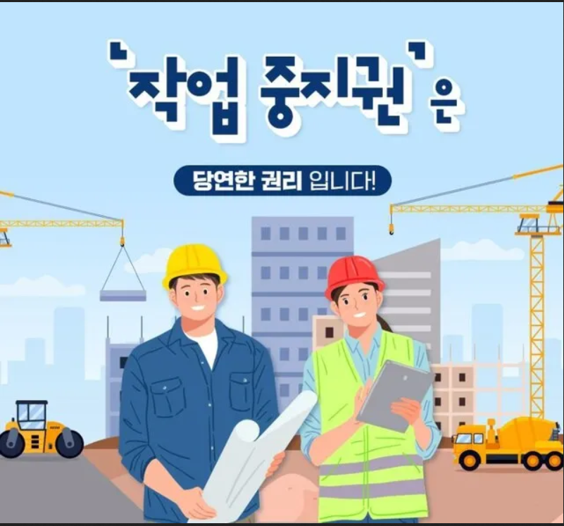

                

                <h2>산업재해 보도, 정답은 없어도 오답은 있다</h2>
                
이시현

                

                    산재 보도를 읽다 보면 노동자 한 사람의 죽음이 쉽게 와닿지
                    않습니다. 높은 건물의 건설현장, 기업 로고, 대통령의 회의
                    사진으로 가득 찬 언론 보도에는 정작 노동자가 보이지
                    않습니다. 일하다 다치고 죽는 사람이 없어져야 한다고 모든
                    언론이 한목소리로 말하지만, 정작 그들의 보도가 산재 근절에
                    얼마나 도움이 되는지는 의문스럽습니다.
                

                

                    산재 보도는 단순한 사실과 수치 나열에 그쳐서는 안 됩니다.
                    현장에서 산재를 야기한 요인을 찾고, 그것이 만들어진 배경을
                    추적해야 합니다. 산재는 우연히 발생하는 사고가 아니며, 많은
                    노동자가 비슷한 상황에서 비슷한 이유로 죽거나 다치고
                    있습니다. 산재를 전하는 언론은 같은 위험을 이곳저곳에서
                    만들어내는 구조적 원인을 드러내야 합니다. 그러나 이에
                    실패하거나 의도적으로 외면하는 언론이 적지 않은데요, 그들이
                    주로 사용하는 세 가지 '오답' 프레임을 분석하고
                    비평하였습니다.
                

            

            

                <h3>프레임 (1) - '기업들 죽는다.'</h3>
                

                    작년 9월, 정부는 지속적으로 산재가 발생하여 연간 3명 이상이
                    사망한 사업장에 대해서, 기업의 영업이익 5%(하한액 30억)를
                    과징금으로 부과하겠다는 대책을 발표했다. 그러자 언론은
                    과징금으로 기업들, 특히 산재 사고가 빈번한 건설사에서
                    줄도산이 발생할 수 있다는 내용의 기사를 연이어 보도했다.
                    이들의 프레임은 한마디로, 산재가 발생한 기업에 관리 부실의
                    책임을 물어 처벌하면 기업도 죽고 업계도 죽는다는 논리에
                    기반한다. 이런 보도를 과연 합리적이라 말할 수 있을까?
                

                <ul class="quote-headline-list">
                    <li class="quote-card quote-card--headline">
                        

                            2025-09-17
                            조선일보
                        

                        

                            건설사 97%, 산재 과징금 맞으면 못버텨
                        

                    </li>
                    <li class="quote-card quote-card--headline">
                        

                            2025-09-15
                            매일경제
                        

                        

                            "현장 사망사고 나면 줄줄이 연쇄부도 "…최악불황
                            건설업에 '산재와의 전쟁' 충격
                        

                    </li>
                    <li class="quote-card quote-card--headline">
                        

                            2025-10-30
                            한국경제
                        

                        

                            산재 기업에 '영업이익 5% 과징금' 적용했더니…5200억
                            '폭탄'
                        

                    </li>
                </ul>
                

                    고용노동부에서 올 1월 발표한 자료에 따르면, 산업재해
                    예방조치 의무를 위반하여 사망재해가 발생한 376곳 중, 연간
                    사망재해가 2건 이상 발생한 사업장은 총 11곳이었다. 과징금
                    부여 대상이 되는 연간 3명 이상 사망재해가 발생한 곳은 단 한
                    곳이었다. 이 사업장의 원청은 '에스지씨이테크건설(현 SGC
                    E&C)'인데, 공시한 2025년 연간 잠정 실적에 따르면 영업이익은
                    528억이었다.
                

                

                    또한 건설업계의 위기는 하루 이틀 일이 아니다. 적자 기업
                    비율은 2021년 19.3%, 2022년 22.5%, 2023년 25%로 증가하는
                    추세로, 일감 수주에 따라 못해도 수십억이 오가는 건설업에서
                    수십, 수백억 적자는 예삿일이다. 설령 건설경기 불황 속에
                    적자를 보는 기업이 있다고 해도, 과징금이 곧바로 도산 위기로
                    이어지진 않는다는 방증이다. 무엇보다 건설업의 위기는 원자재
                    비용 상승과 금리 인상 등 불확실한 경기 전망 속에서 무리한
                    프로젝트 파이낸싱과 부동산 경기 부양 등 업계와 정부가 자초한
                    결과로, 그것이 산업재해에 대한 면책 사유가 되기는 어렵다.
                

                

                    부동산 경기 과열에 대한 우려를 묵과해온 일부 언론이 산재
                    과징금에 대해서만 이 같은 보도를 내는 것은, 산업재해 책임
                    강화를 문제 삼기 위해 업계 전반의 붕괴 가능성을 과장하는
                    공포 프레이밍일 뿐이다. 산재 처벌로 기업이 망한다는 허황된
                    공포가 언론을 통해 유포되는 지금 이 순간에도, 어디선가
                    누군가는 일하다 죽고 다친다. 2018년 고 김용균 씨 사망 이후
                    중대재해기업처벌법 제정 운동이 시작된 지 7년이 지난 지금도
                    연간 사망자 수는 2098명으로 당시와 크게 다르지 않다. 이미
                    죽고 다친 사람이 실재하는 상황에서, 단지 많은 사람이
                    공유하는 허상일 뿐인 '회사'가 죽는다는 식으로 말하는 것은
                    경중을 완전히 잘못 짚은 주장이다.
                

                <figure class="essay-image media-figure">
                    
                    <figcaption>연도별 산업재해 사망자 추이 그래프</figcaption>
                </figure>
                

                    한편 일부 언론에선 구조적 원인을 지적하면서도, 처벌 수준이
                    과도하다는 여론을 은근히 조성하여 논점을 흐리는 보도 역시
                    즐비하다.
                

                <blockquote class="quote-card quote-card--body">
                    

                        2025-09-17
                        조선일보
                    

                    

                        건설사 97%, 산재 과징금 맞으면 못버텨…
                    

                    

                        "최저가 입찰제를 사용하는 곳이 많아서 이미 공사비가
                        충분치 않은데 거기에 처벌에 따른 과징금 부담까지 커지면
                        사업 참여를 꺼릴 수밖에 없다."
                    

                </blockquote>
                <blockquote class="quote-card quote-card--body">
                    

                        2025-07-05
                        매일경제
                    

                    

                        정부 최저 입찰로 하청 부추기는데… [산업 현장의 구조적
                        문제]…
                    

                    

                        무한 가격 경쟁으로 내모는 계약·발주
                        제도(최저가·종합심사낙찰제)다. 국내 공공·민간 발주
                        대부분이 가격 경쟁 위주다. 발주자는 최저가 입찰로 공사를
                        발주하고 원청은 낮은 공사비와 촉박한 공기 속 공정 압박을
                        견디려 하청과 재하도급을 반복한다.
                    

                </blockquote>
                

                    구조적 원인을 해결해야 한다는 지적은 옳다. 그러나 그들의
                    보도는 구조적 원인 개선과 책임 부여가 마치 서로 배타적인
                    것처럼 호도한다. '처벌만으론 부족하다'와 '처벌로는 안
                    된다'는 명백히 다르다. 그들이 지적하는 건설현장의 구조적
                    원인인 최저가 입찰제와 불법 하도급에 따른 산재 유발을
                    해결하기 위한 취지로 발주자, 감리자, 설계자, 시공자의 책임을
                    명확히 하는 건설안전특별법이 발의되자, 앞서 구조적 원인
                    해결을 명분으로 처벌 무용론을 내세우던 몇몇 언론은 이에 대한
                    업계의 우려 섞인 목소리를 앞세워 보도했다. 역시나 처벌
                    조항이 과도하다는 이유였다.
                

                <ul class="quote-headline-list">
                    <li class="quote-card quote-card--headline">
                        

                            2025-07-05
                            매일경제
                        

                        

                            사망사고 땐 매출 3% 과징금...건설 업계 '전전긍긍'
                            [국회 방청석]
                        

                    </li>
                    <li class="quote-card quote-card--headline">
                        

                            2025-07-03
                            조선비즈
                        

                        

                            사망 사고 발생 시 '매출액 최대 3% 과징금'
                            법안에…건설업계 "우려"
                        

                    </li>
                </ul>

                

                    결국 그들 보도의 방점은 여전히 기업 면책에 찍혀 있는 것이며,
                    그러한 언론이 전파하는 '처벌보다 예방'론은 현재 상황에 대한
                    직시 없이 기업을 옹호하는 공허한 외침일 뿐이다. 그들은
                    처벌이 과도하다고 말하지만, 처벌이 제대로 이뤄지고 있다고
                    보긴 어렵다. 지난 4년간 중대재해처벌법 적용 대상 산재 사건
                    1521건 중 수사 이후 검찰에 송치된 사건은 18%에 불과하다.
                    그중 유죄판결을 받은 사건은 65건이며 실형은 고작 6건에
                    그쳤다. 벌금형 또한 대부분 1억 원 미만이다. 일부 언론의
                    호들갑과 달리, 중대재해처벌법의 존재에도 불구하고 우리
                    사회는 산재 기업에게 여전히 솜방망이 처벌을 가하고 있다.
                    그럼에도 건설사의 광고를 먹고 사는 많은 언론은 "기업이
                    죽는다"는 가상의 위기를 앞세우며 진실을 호도한다.
                

                <h3>프레임 (2) - '산재 핑계로 태업'</h3>
                

                    이 프레임의 기사들 역시 산업재해 처벌에 대한 반대 의견을
                    내세우면서 화살을 노동자에게 돌린다. 주로 노동자들이 산재를
                    핑계로 태업할 수 있다는 인식을 확산한다.
                

                

                    최근 정부가 강화하겠다고 밝힌 '작업중지권' 관련 보도에서 이
                    프레임을 쉽게 찾아볼 수 있다. 일부 언론은 '노조가
                    작업중지권을 회사와의 힘겨루기 수단으로, 파업 등 쟁의행위의
                    면죄부로 악용할 것이다'와 같은 논조의 보도를 이어왔다.
                    작업중지권이 노동조합의 파업 행위를 정당화하고, 그로 인한
                    잦은 쟁의로 현장은 툭하면 멈춘다는 것이다. 이처럼 노동조합을
                    악마화하고, 노동쟁의를 불경시하는 몰상식한 노동관에 기초한
                    보도는 작업중지권의 본래 취지인 산업재해 예방을 흐리고
                    갈등만 부각한다.
                

                <figure class="essay-image media-figure">
                    
                    <figcaption>작업중지권 관련 보도 화면</figcaption>
                </figure>
                

                    노동자들이 산업재해를 무기 삼을 것이라는 언론의 프레임에선
                    노동에 대한 존중을 찾아볼 수 없으며, 노동자는 단지 '농땡이'
                    피우려는 존재로만 묘사된다. 이 같은 잘못된 인식은 산업재해의
                    위험이 높은 육체노동을 '저급한 노동'으로 폄하하는 한국
                    사회의 엘리트주의에 기대어 더욱 쉽게 확산되고, 다시금
                    엘리트주의를 더욱 강화하는 악순환을 낳는다. 언론의 잘못된
                    프레임으로 인해 우리 사회의 노동 담론은 더욱 후퇴하게 되는
                    셈이다. 숱한 생명이 걸린 산재 문제를 다루는 언론 보도에선
                    산업재해를 빌미로 태업을 일삼는 상상의 노동자보다 안전장치
                    부재로 희생되는 현실의 노동자가 그려져야 한다.
                

                <h3>프레임 (3) - '개인의 부주의'</h3>
                <ul class="quote-headline-list">
                    <li class="quote-card quote-card--headline">
                        

                            2025-09-17
                            서울경제
                        

                        

                            올해 건설 사고 54%가 '작업자 부주의'탓…"기업 처벌로
                            해결 안돼"
                        

                    </li>
                </ul>
                

                    이 프레임은 산업재해 발생의 책임과 문제 해결의 부담을 노동자
                    개인에게 전가하는 논리다. 또한 산업재해 근절에 필수적인
                    구조적 원인 파악을 흐리고, 문제를 개인 실천이라는 규범적
                    차원으로 치환해 실질적인 개선을 방해한다.
                

                

                    여전히 많은 언론 보도는 노동자가 '귀찮아서' 규칙을 지키지
                    않는 것처럼 이야기하지만, 그러한 표면적 진술은 마감 시간과
                    작업 물량 압박에 쫓기는 현장의 구조적 문제를 은폐한다.
                    규칙과 마감 시간 혹은 작업량을 모두 준수하는 것이 물리적으로
                    불가능에 가까운 현장에선 사람만 바뀔 뿐, 같은 유형과 원인의
                    사고가 반복될 수밖에 없다. 그럼에도 언론은 노동자가 마치
                    안전을 지킬 수 있는 선택의 여지가 있었던 것처럼 서술하여
                    사고의 책임을 '안전을 선택하지 않은 노동자'에게 떠넘긴다.
                

                <blockquote class="quote-card quote-card--body">
                    

                        2025-09-17
                        조선일보
                    

                    

                        유독 포스코이앤씨에만 집중포화… 정치적 의도 있나…
                    

                    

                        보고서에 따르면 지난해 중대재해 3건 모두 주말
                        전후(월요일 2건, 금요일 1건)에 발생했다. 특히 사고
                        시간대는 모두 정규 작업 시작이나 종료 전후 1시간
                        이내였고, 이 시간대에 임의로 작업하거나 안전 기준을
                        지키지 않았다가 발생한 것으로 분석됐다. 포스코 그룹은 이
                        같은 분석을 바탕으로 ‘휴일 작업에 대한 사전 승인과 작업
                        종료 전·후 집중 관리’, ‘CCTV 모니터링 강화’ 같은
                        구체적인 재발 방지책까지 제시했다.
                    

                </blockquote>
                

                    조선일보는 작년 포스코이앤씨의 연이은 산업재해를 다루며,
                    마치 '휴일 전후 부주의' 때문에 산업재해가 발생하는 것처럼
                    보도했다. 그들의 보도는 사고 패턴을 알고 대책을
                    제시했으면서도 사고를 막지 못했다며, 산재를 마치 불가피한
                    재해라는 인식을 유도한다. 그러나 패턴화된 사고를 알고도 막지
                    못했다는 사실은, 기업이 자발적으로 세운다는 '대책'이라는
                    것이 얼마나 미봉책에 불과한지 드러낼 뿐이다. 포스코이앤씨의
                    대책이라며 조선일보가 보도한 'CCTV 모니터링', '휴일 작업
                    관리 강화' 등으로는, 물량과 공기 압박에 시달리는 노동자가
                    '알면서도 위험으로 자신을 내모는 일'을 막지 못한다. 이와
                    같이, '개인의 부주의' 프레임은 구조적 원인을 뒤로 한 채
                    표면에 드러나는 과실의 책임을 노동자에 전가한다.
                

                

                    언론은 산업재해를 다루면서 '기업이 죽는다', '산재 핑계로
                    태업', '개인의 부주의'라는 세 가지 프레임을 반복해
                    사용해왔다. 여전히 우리는 한 해 2000여 명이 산재 사고와
                    질병으로 죽는 사회, 위험은 아래로 흐르고 이윤은 위로 흐르는
                    사회에서 살아가고 있다. 기업의 책임을 은폐하고, 산재 문제의
                    논점을 흐리며 공론장을 왜곡해온 언론과 프레임은 이제
                    사라져야 한다.
                

            

        

        

            <button type="button" class="page-nav-btn" data-dir="-1">
                이전
            </button>
            
1 / 1

            <button type="button" class="page-nav-btn" data-dir="1">
                다음
            </button>
        

        
