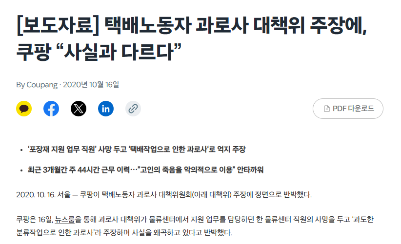
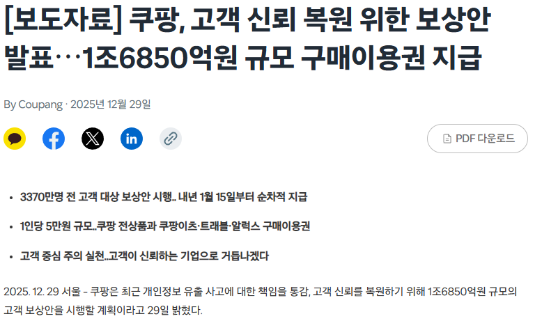
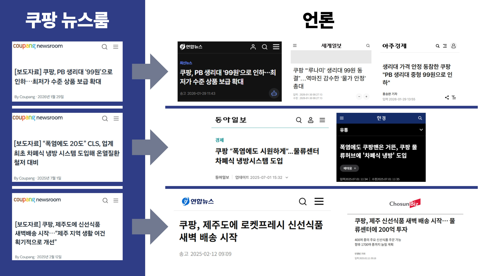
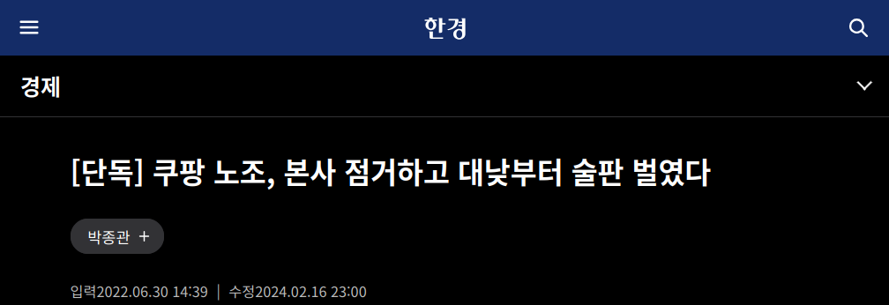

                

                <h2>쿠팡의 든든한 조력자, 언론</h2>
                
박성운

                

                    쿠팡의 꾸준한 언론플레이에는 언제나 언론이란 조력자가
                    있었습니다. 많은 언론들이 쿠팡의 성과와 실적을 적극
                    홍보하며, 수많은 잘못에 눈감은 채 '혁신'의 이름표를 쿠팡에
                    달아줬습니다. 그러다 쿠팡이 여론의 질타를 받기라도 하면,
                    그들은 마치 대변인이라도 된 것처럼 쿠팡의 변명을
                    되풀이하기도 했습니다. 한국 사회에 뿌리 깊게 박힌 노조
                    혐오를 바탕으로, 쿠팡과 싸우며 변화를 요구하는 목소리를
                    왜곡하기도 했습니다.
                

            

            

                <h3>뉴스룸 받아쓰기</h3>
                

                    쿠팡엔 '뉴스룸'이 있다. 쿠팡은 언론사가 아닌데, 왜 뉴스룸이
                    있을까? 쿠팡 뉴스룸은 대외 홍보와 마케팅 수단으로 기능한다.
                    노동자 사망, 개인정보 유출 등 굵직한 사회적 이슈가 있을
                    때마다 쿠팡은 뉴스룸에 자사 입장을 보도자료 형태로
                    게시하기도 한다.
                

                

                    <figure>
                        
                    </figure>
                    <figure>
                        
                    </figure>
                

                

                    자사 물류센터에서 코로나19 집단감염 사실을 은폐한 쿠팡에
                    비난이 쏟아지자, 쿠팡은 뉴스룸을 통해 보도자료를 발표하며
                    집단감염의 원인이 성실히 역학조사에 임하지 않은 학원 강사에
                    있다고 주장했다. 개인정보 유출 사건이 발생하자 쿠팡은 할인
                    쿠폰을 통한 보상 계획을 뉴스룸을 통해 홍보했다. 과로사
                    사건으로 규탄받던 쿠팡은 뉴스룸을 통해 노조가 사실을
                    왜곡한다며 반박했다. 공정과 신뢰를 연상케 하는
                    '뉴스룸'이라는 이름에 걸맞지 않게, 쿠팡 뉴스룸은 어디까지나
                    자사의 입장을 대변하는 전형적인 사보에 지나지 않는다.
                

                

                    <figure>
                        
                    </figure>
                

                

                    문제는 언론의 게으른 저널리즘이다. 비단 보도자료를 제공하는
                    기업이 쿠팡뿐만은 아니지만, 쿠팡의 보도자료는 마치 언론사가
                    '복붙'하기 편하도록 기사 형태로 게시된다. 그리고 많은 언론은
                    실제로 이를 그대로 복붙하거나 그들의 표현을 그대로
                    받아쓰기한다. 쿠팡의 보도자료가 고스란히 전재된 기사를
                    비판적으로 독해하지 않는 독자는 무의식적으로 쿠팡의 입장을
                    내면화한다. 게으른 언론이 쿠팡의 홍보팀 역할을 자처하는
                    것이다.
                

                <h3>노조혐오와 가짜뉴스</h3>

                

                    한국 언론의 뿌리 깊은 노조 혐오는 쿠팡의 반노동적 행태를
                    우리 사회가 묵인하는 데 일조해왔다. 지난 2022년 6월,
                    공공운수노조 전국물류센터지부 쿠팡물류센터지회는 서울
                    송파구에 위치한 쿠팡 본사 로비에서 쿠팡에 폭염 대책 마련,
                    유급 휴게시간 보장, 생활임금 보장 등을 요구하며 점거 농성을
                    벌였다. 실제로 그해 7월, 쿠팡 동탄물류센터에서 3명의 여성
                    노동자가 근무 중 쓰러지는 사고가 발생하기도 했다. 사고 당시
                    현장 온도는 평균 32도, 습도는 60%에 달했는데 이는 수많은
                    노동자가 일하는 쿠팡의 물류센터가 인간이 아닌 오직 물류만을
                    위한 공간이었다는 증거이기도 했다. 2020년부터 잇따른 노동자
                    사망사고에 대한 대책을 마련하라는 요구에 쿠팡은 묵묵부답으로
                    일관했고, 노조는 점거 농성을 시작한 것이었다.
                

                

                    쿠팡은 이들의 점거 농성에 대해 불법이라 단정 짓고 법적으로
                    대응하겠다며 강경하게 나섰다. 그러자 많은 언론들은 쿠팡의
                    입장을 그대로 표제에 반영하며, 쿠팡 노조의 쟁의행위에
                    '불법성'을 덧칠했다. 쿠팡은 물류센터지회와 진행한 수차례
                    교섭에서 요구를 무시했으며, 이에 지회는 점거의 방식으로
                    쟁의행위에 나섰다. 판례에 따르면, 쟁의행위로서 직장 점거는
                    배타적이지 않은 경우 합법적인 행위로 인정되고 있다. 따라서
                    쿠팡의 입장을 그대로 전달하는 언론 보도는 사건 자체의 불법성
                    여부와 관련 없이 노조에 대한 불리한 여론을 조성하려는 의도의
                    불공정하고 편파적인 보도 행태이다.
                

                

                    <figure>
                        
                    </figure>
                

                

                    특히, 2022년 6월 30일자 한국경제와 조선일보의 보도는 더욱
                    악질적이다. 이들은 각각 쿠팡 노조가 본사를 점거하고 술판을
                    벌였다는 내용의 기사를 내보냈는데, 알고 보니 그런 일은 아예
                    없었던 것이었다. 이들은 독자가 제공했다고 하는 사진 한 장을
                    가지고서, 별다른 출처도 없이 '노조가 술판을 벌였다'는 허위
                    사실을 게재했는데, 이러한 보도 행태는 본질상 '카더라' 내지
                    '찌라시'에 다름 아니었다. 또한 기사의 나머지 내용이 노조에
                    대한 주변의 부정적인 시선을 전달하는 것에 그친 점을 볼 때,
                    이들의 오보는 노조 혐오 선동을 위한 악의적 편집이 낳은
                    결과였다. 노조는 이들 언론사를 고소했고, 2024년 법원은
                    정정보도문을 게시하라는 선고를 내렸다. 그러나 한국경제와
                    조선일보는 법원의 명령으로부터 한 달이나 지나서야
                    정정보도문을 게시했다.
                

                

                    쿠팡이 법의 회색지대에서 불안정 노동으로 요약되는 자신들만의
                    뉴노멀을 만들어가는 동안, 노동조합과 그에 연대한 시민사회의
                    투쟁은 사실상 쿠팡을 견제할 수 있는 거의 유일한 힘이었다.
                    그런데 경제지상주의와 노조 혐오에 물든 기성 언론은 노동자의
                    목소리를 담기보다 쿠팡의 입장을 대변하는 데 치우쳤고, 그
                    결과 괴물의 탄생을 막기는커녕 오히려 키우는 데 일조한
                    언론에게도 우리는 책임을 물어야 한다.
                

            

