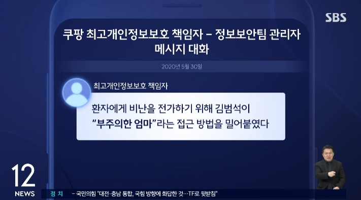
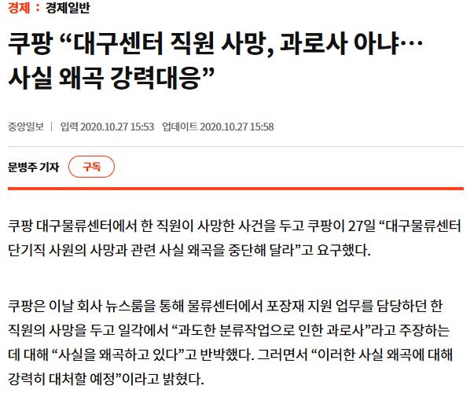
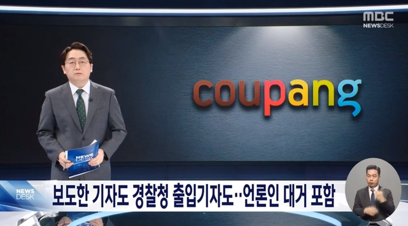
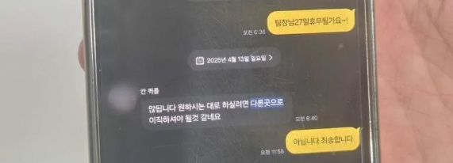
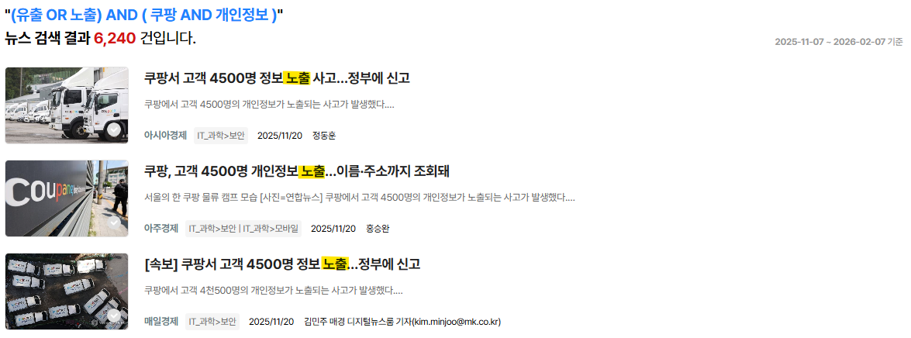
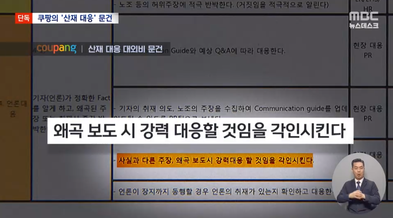
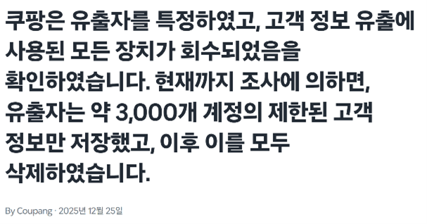

                

                <h2>역대 쿠팡 언론플레이 총정리.zip</h2>
                
박성운

                

                    한국 유통업계의 혁신, 한국 1호 유니콘 기업, 혁신적인 기업은
                    모두 언론이 쿠팡을 수식할 때 쓰는 표현입니다. 우리에게
                    쿠팡은 로켓배송을 앞세워 해외에서도 인정받은 혁신 기업의
                    이미지로 남아 있습니다. 그러나 그 이면엔 감춰진 진실도
                    존재합니다. 최근 개인정보 유출 등의 문제로 쿠팡을 바라보는
                    부정적 시선이 커졌지만, 그 이전에도 쿠팡은 노동자 착취와
                    언론 조작을 통해 치부를 감추고 자사를 미화하는 언론플레이를
                    지속해 왔습니다.
                

            

            

                

                    

                        
2020.04

                        <h3>코로나19 집단감염 책임 전가</h3>
                        

                            <figure>
                                
                            </figure>
                            <figcaption>
                                쿠팡 최고개인정보보호책임자 제보 내용
                            </figcaption>
                        

                        <ul class="bullet-list">
                            <li>
                                쿠팡 부천물류센터에서 코로나 집단감염이 발생.
                            </li>
                            <li>
                                당시 쿠팡 최고개인정보보호책임자 제보에 따르면,
                                최초 감염자의 부주의로 책임을 전가하기 위해 언론
                                매체를 활용하려 함.
                            </li>
                            <li>
                                언론플레이를 위해 직원 SNS까지 뒤지며 대응
                                문서를 작성.
                            </li>
                            <li>
                                그러나 재판부는 감염에 취약한 근무환경을 조성한
                                점에 대해 쿠팡의 책임을 인정.
                            </li>
                        </ul>
                    

                

                

                    

                        
2020.10

                        <h3>故 장덕준 씨 산재 은폐</h3>
                        

                            <figure>
                                
                            </figure>
                            <figcaption>
                                과로사 사건에 대한 쿠팡의 대응
                            </figcaption>
                        

                        <ul class="bullet-list">
                            <li>
                                쿠팡 물류센터에서 일했던 故 장덕준 씨가 2020년
                                10월 야간근무 이후 집에서 심근경색으로 사망.
                            </li>
                            <li>
                                당시 27세였고, 일을 시작하기 전 75kg이었던 장
                                씨의 몸무게는 사망 직전 60kg까지 감소.
                            </li>
                            <li>
                                산재 심사 과정에서 쿠팡은 장 씨의 죽음이 '과도한
                                다이어트' 때문이라고 주장.
                            </li>
                            <li>
                                또한 과로가 본인의 선택이었다는 취지의
                                보도자료를 공개하며 '사실 왜곡에 강력히
                                대응하겠다'고 엄포를 놓았음.
                            </li>
                        </ul>
                    

                

                

                    

                        
2024.02

                        <h3>언론인 블랙리스트 작성</h3>
                        

                            <figure>
                                
                            </figure>
                        

                        <ul class="bullet-list">
                            <li>
                                쿠팡이 1만 6천여 명의 개인정보를 담은
                                블랙리스트를 관리해온 사실이 드러났음. 이 중
                                100여 명은 기자와 PD 등 언론인이었음.
                            </li>
                            <li>
                                쿠팡의 열악한 노동환경을 보도하기 위해
                                물류센터를 잠입 취재한 기자뿐 아니라, 관련
                                기사를 쓴 적이 없는 서울시 경찰서 출입
                                기자들까지 '내부정보 외부유출', '명예훼손' 등의
                                사유로 블랙리스트에 등재됐음.
                            </li>
                            <li>
                                비판을 수용하기보다 비판의 목소리를 틀어막으려는
                                것 아니냐는 비판이 일었음.
                            </li>
                        </ul>
                    

                

                

                    

                        
2025.11

                        <h3>과로사를 음주운전으로 호도</h3>
                        

                            <figure>
                                
                            </figure>
                            <figcaption>
                                고인의 휴무 요청에 "원하는 대로 하려면 다른
                                곳으로 이직하라"며 거부한 영업점 팀장의 카카오톡
                                대화
                            </figcaption>
                        

                        <ul class="bullet-list">
                            <li>
                                쿠팡 택배노동자 故 오승용 씨가 부친상 이후 업무
                                복귀 첫날 전신주를 들이받아 사망.
                            </li>
                            <li>
                                당시 고인은 주 6일, 하루 11시간 30분씩 일했으며
                                야간 노동 가산 기준으로 계산하면 주 83.4시간에
                                해당.
                            </li>
                            <li>
                                그러나 쿠팡 택배 영업점 대표는 고인이 '50시간'
                                쉬고 출근했다며 과로사를 부정하고, 다수 언론에
                                음주운전 의혹 제기 메일을 전송.
                            </li>
                            <li>경찰은 음주운전 혐의를 부정.</li>
                        </ul>
                    

                

                

                    

                        
2025.11

                        <h3>개인정보 유출 책임 축소</h3>
                        

                            <figure>
                                
                            </figure>
                            <figcaption>
                                '노출'로 표현된 개인정보 유출 사건 초기 언론
                                보도
                            </figcaption>
                        

                        <ul class="bullet-list">
                            <li>
                                2025년 11월 약 3,370만 건에 달하는 회원의 성명,
                                주소, 연락처 등이 대량 유출된 사실이 확인.
                            </li>
                            <li>
                                유출 이후 쿠팡은 개인정보 '유출'을 '노출'로
                                발표.
                            </li>
                            <li>
                                '유출'과 달리 '노출'은 정상 경로로 알 수 있게
                                공개된 상태를 뜻하는 표현.
                            </li>
                            <li>
                                쿠팡은 의도적으로 '노출'이라는 표현을 사용해
                                보도자료를 인용한 언론을 통해 책임을 희석하려
                                함.
                            </li>
                            <li>
                                비판이 일자 개인정보위는 쿠팡에 "유출은 유출로
                                정확히 표현하고 피해 범위도 명확히 안내하라"고
                                요구.
                            </li>
                        </ul>
                    

                

                

                    

                        
2025.12

                        <h3>산재 대응 문건</h3>
                        

                            <figure>
                                
                            </figure>
                        

                        <ul class="bullet-list">
                            <li>
                                산재 발생 시 쿠팡 내부의 대응 지침이 담긴 문건이
                                공개.
                            </li>
                            <li>
                                장례 시작 단계부터 유족과 동행해 외부로 '오염된
                                정보'가 나가는 것을 차단하고, 언론이 취재를
                                시작할 때 왜곡 보도에 강력 대응하겠다는 인식을
                                심는 내용이 담겼음.
                            </li>
                            <li>
                                또 고용노동부의 작업중지명령을 방지해야 한다는
                                내용도 포함돼, 반성과 산재 예방보다 여론 관리에
                                급급한 모습을 방증.
                            </li>
                        </ul>
                    

                

                

                    

                        
2025.12

                        <h3>개인정보 유출 피해 축소한 자체조사 발표</h3>
                        

                            <figure>
                                
                            </figure>
                            <figcaption>
                                쿠팡 뉴스룸을 통해 자체 조사 결과 발표
                            </figcaption>
                        

                        <ul class="bullet-list">
                            <li>
                                쿠팡이 개인정보 유출 피해 규모에 대해 "고객 정보
                                유출에 사용된 모든 장치가 회수되었으며, 유출자는
                                약 3,000개 계정의 제한된 고객 정보만 저장했다"는
                                내용의 보도자료를 발표.
                            </li>
                            <li>
                                쿠팡은 해당 조사를 정부와 경찰과의 긴밀한 협조로
                                진행했다고 밝혔지만 경찰은 해당 사실에 대해
                                사전협의가 없었다고 밝혀, 증거 오염 가능성이
                                제기됨.
                            </li>
                            <li>
                                이후 뒤늦게 3천여 명이 아닌 16만 5천여 명의
                                개인정보가 유출됐다고 추가 발표.
                            </li>
                        </ul>
                    

                

            

