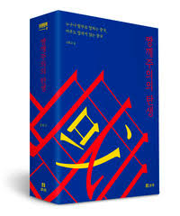
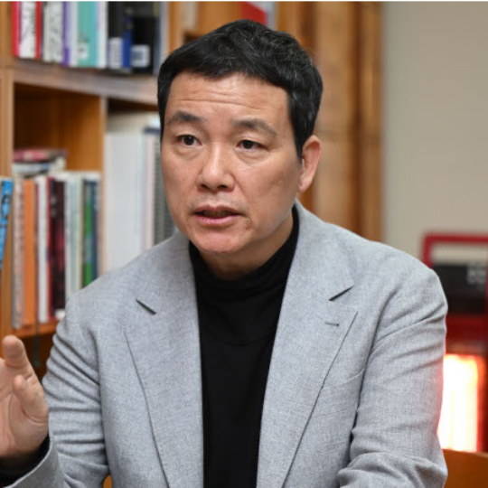
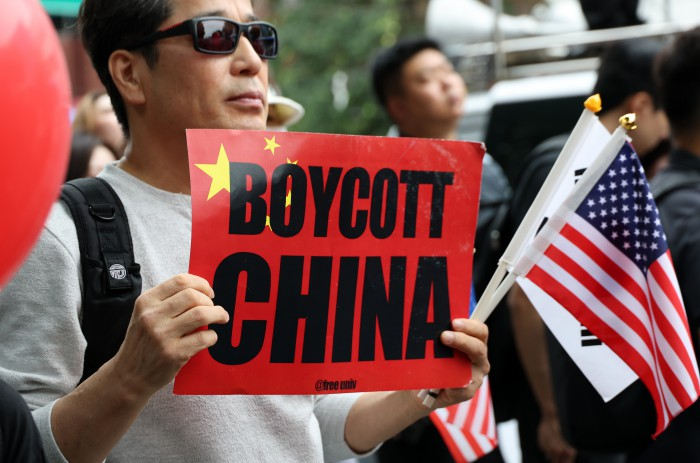
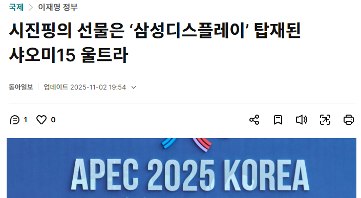

                

                <h2>[인터뷰] 도서『짱깨주의의 탄생』저자를 만나다</h2>
                
양승우

                <figure class="header-image">
                    
                </figure>
                

                    최근의 '혐중' 현상에서 드러나듯, 한국 사회의 대중(對中)
                    감정은 빠르게 악화하고 있습니다. 도서 『짱깨주의의 탄생』은
                    
                        중국 담론을 확산시키는 주요 경로인 언론 보도가 한국
                        사회의 중국 인식을 어떠한 방식으로 왜곡해왔는지
                    
                    를 비판적으로 조명합니다. 또한 다가온 다자주의 세계 질서
                    속에서 한중 관계의 발전 가능성을 평화체제의 관점에서
                    전망합니다. 필화는 혐중 현상을 조명하는 과정에서
                    『짱깨주의의 탄생』 의 저자, 광운대학교 동북아문화산업학부의
                    김희교 교수님을 만나 인터뷰를 진행했습니다. 이 글에서는 그중
                    일부를 소개합니다.
                

            

            

            

                

                    

                        
                    

                    

                        
한국의 인종주의와 혐중은 어디서 비롯한 것인가요?

                    

                

                

                    

                        
                    

                    

                        

                            우리가 일제의 식민지배를 받을 당시, 친일파들은
                            식민주의 사상을 옹호하고 유입시키면서 자신의
                            사상으로 만들었습니다. 우리가 해방이 되었지만,
                            식민주의는 일부 세력에 다양한 형태로 유전되어
                            왔습니다. 해방 이후 우리 사회 주류의 가치관 밑바탕에
                            식민주의가 남아있는 탓에, 인종주의적 요소도 잠복해
                            있었던 거죠.
                        

                        <figure
                            class="interview-image media-figure interview-image--newspim"
                        >
                            
                            <figcaption>
                                혐중 시위엔 항상 성조기가 등장한다. 사진 출처 -
                                뉴스핌
                            </figcaption>
                        </figure>
                        

                            반공정서가 강했을 때는 중국을 이념적으로 적대했고,
                            1990년대 이후엔 중국을 돈이 되는 나라로 취급했죠.
                            그러다 부상하는 중국과 이를 막으려는 미국이 중국과
                            충돌하게 됩니다. 미국이 중국을 더 이상 압도하지
                            못하는 불안감이 생기면서 한국 사회의 친미주의가
                            흔들렸고, 그러면서 마침내 반중정서가 고양되기
                            시작했습니다. 그러니까, 혐중은 위기감을 느낀
                            식민주의 세력이 더 강하게 목소리 내는 것에서
                            비롯했다고 볼 수 있습니다. 그만큼 불안하다는 거죠.
                        

                    

                

            

            

            

                

                    

                        
                    

                    

                        

                            최근 APEC 정상회담을 계기로 열린 한중정상회담에서
                            시진핑 주석이 이재명 대통령에게 샤오미 스마트폰을
                            선물했습니다. 이에 대해 많은 언론은 '기술 탈취
                            이슈를 고려한 것'이라고 추측하였는데, 이런 추측에
                            대해 교수님께선 어떻게 생각하시는지요?
                        

                    

                

                

                    

                        
                    

                    

                        

                            중국이 화웨이가 아닌 샤오미 폰을 고른 건, 샤오미
                            폰이 한중 합작품이라서 그래요. 중국의 산업과 기술이
                            한국을 따라잡거나 뛰어넘는 부분도 많지만, 여전히
                            한중 사이엔 협력의 여지가 많다는 메시지를 담은
                            것이죠. 굳이 화웨이를 선택하지 않은 이유는 한국
                            국민에게 화웨이에 대한 공포가 있고, 그걸 굳이
                            자극하고 싶지 않았던 거죠. '화웨이의 문제는 삼성도,
                            애플도 마주한 문제인데,
                            
                                왜 기술의 문제를 정치의 문제로 만드는가
                            
                            '가 중국의 입장이죠.
                        

                        <figure class="interview-image media-figure">
                            
                            <figcaption>
                                시진핑 주석이 선물한 샤오미 스마트폰은 '샤오미
                                울트라 15' 기종이었는데, 당시 샤오미의 플래그십
                                모델 중 최신 기종은 '샤오미 17 프리미엄'이었다.
                            </figcaption>
                        </figure>
                        

                            백도어와 정보수집 같은 문제가 중국만이 꾸미는 어떤
                            음모처럼 생각하는 건 말이 안 된다고 생각해요.
                            애플이나 테슬라도 그런 문제에서 자유로울 수가
                            없습니다. 근데 우리는 그런 점들을 잘 차단할 수 있을
                            거라 생각하면서 사용하고 있잖아요? 그런데 중국만은
                            예외적으로 생각하는 것은 이상하죠. 중국의 기술이 그
                            정도로 뛰어난가요? 어떨 땐 중국을 한없이 깔보다가,
                            어떨 때는 중국을 과대평가하는 모순인 거죠. 정작
                            그러다가 우리가 중국에 대해서 경쟁력을 가져야 할
                            기술의 문제를 놓치게 됩니다.
                        

                    

                

            

            

            

                

                    

                        
                    

                    

                        

                            마지막으로 청년 세대가 혐중 문제에서 할 수 있는 것이
                            있다면 무엇일까요? 또, 대학생에게 해주시고 싶은
                            말씀이 있을까요?
                        

                    

                

                

                    

                        
                    

                    

                        

                            오랜 기간 학교에서 수업을 하면서, 점점 공동체 문제에
                            관심을 가지는 학생들이 사라지는 것 같다는 생각을
                            해왔어요. 그러다 2025년 초 광장에서 많은 청년들을
                            보고 사라진 게 아니라 보지 못했을 뿐이란 걸
                            깨달았습니다. 혐중 문제에 관해서도 최근에 여기저기서
                            강연이나 인터뷰 등으로 연락이 오더라고요. 이 문제가
                            우리의 문제라고 생각하는 사람들이 많이 늘어나서
                            다행인 것 같아요.
                        

                        

                            청년 세대에게 하고 싶은 말은,
                            청년의 문제는 청년이 해결할 수 있다는 겁니다. 역사를 보면, 누구의 문제는 절대 다른
                            누군가가 해결해 주지 않는다는 겁니다. 지금 청년
                            세대에서 혐오의 문제가 많은 것은 결국 청년 세대에
                            지워진 짐이 너무 많기 때문인데, 그 문제를 풀기 위해
                            노력하는 사람들이 많이 나타났으면 좋겠다는 생각을
                            합니다.
                        

                    

                

            

