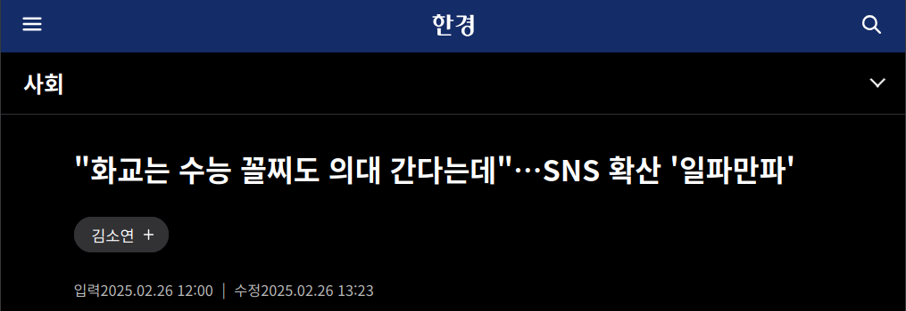
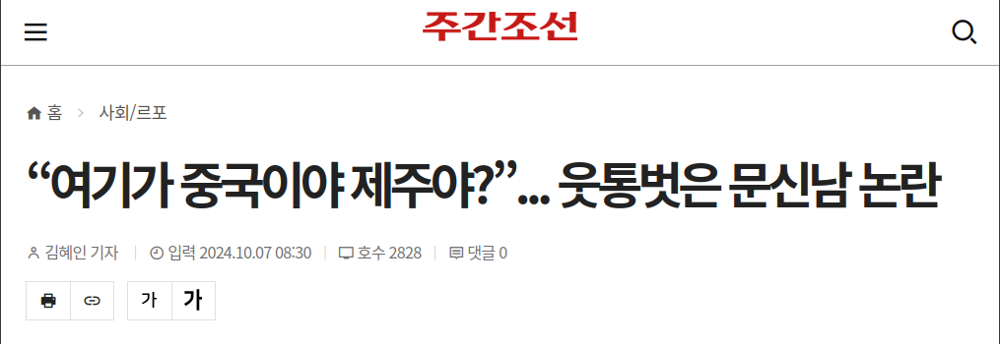
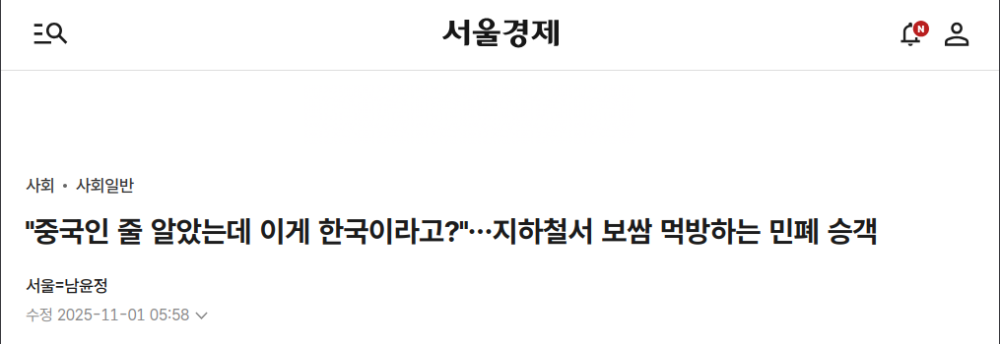
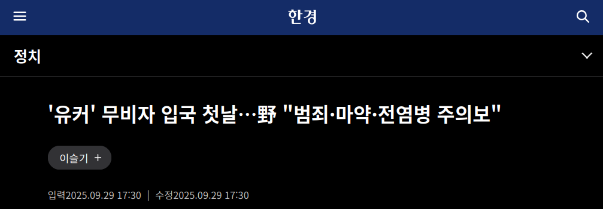
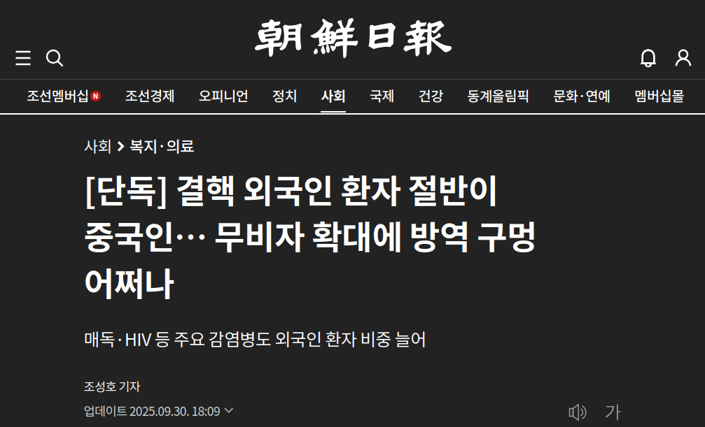
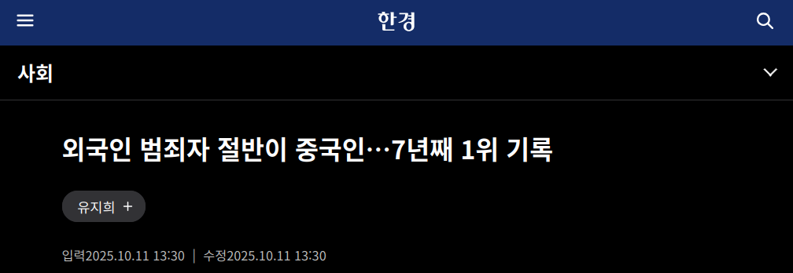
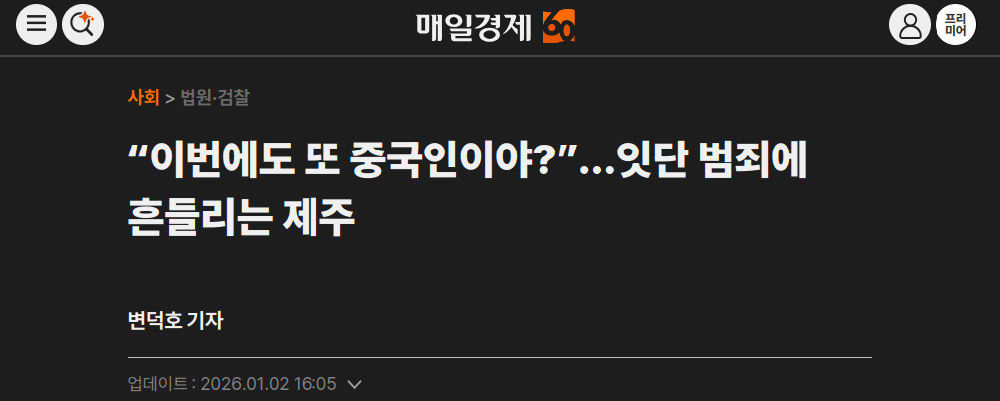
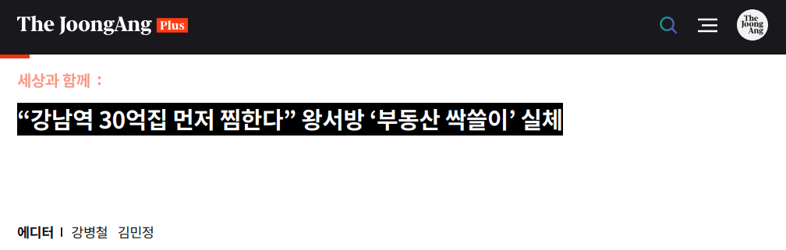
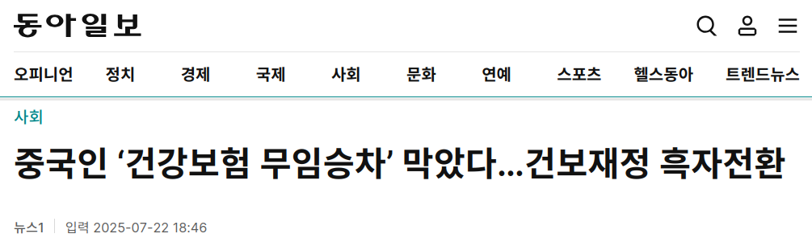
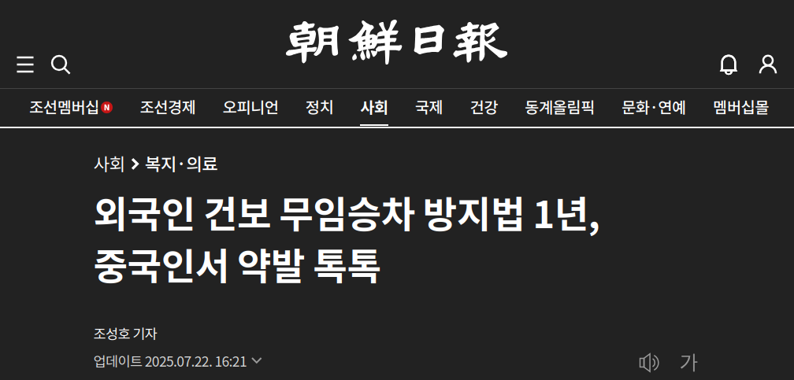

                

                <h2>아무도 책임지지 않는 중국 뉴스</h2>
                
양승우

                

                    혐중이 만연한 요즘, 주위에서 중국과 중국인에 대해 아무렇게나
                    말하는 사람을 쉽게 찾아볼 수 있습니다. 그러나 그들 중 중국과
                    중국인을 잘 아는 사람은 몇이나 될까요? 모든 한국 사람이
                    다르고, 한국에 대한 인식도 모두가 다릅니다. 중국인과 중국
                    역시 마찬가지입니다. 그러나 혐오는 이 모든 것을 동질화하고
                    적대감 속에서 바라보게 만듭니다. 이 글은 공명정대해야 할
                    언론이 역사와 관습의 차이를 무시한 채 기계적 상호주의를
                    강조하거나 사실관계를 교묘히 편집하는 보도, 그리고 잘못된
                    음모론을 모아 정리했습니다. 이 글이 중국 관련 기사를 조금 더
                    비판적으로 읽는 데 도움이 되기를 바랍니다.
                

            

            <section class="fact-card">
                

                    
1

                    <h3>중국인만을 위한 대학 전형이 있다?</h3>
                    

                        사실관계가 잘못됨
                    

                

                

                    <figure class="fact-image">
                        
                    </figure>
                    

                        
이슈

                        

                            중국인 또는 화교를 위한 입시 전형이 있어서 상위권
                            대학에 쉽게 진학할 수 있다는 주장이 온라인 커뮤니티
                            및 SNS 등지에서 확산됐음.
                        

                    

                    

                        
문제점

                        <ul class="fact-list">
                            <li>
                                현재 외국인 전형과 재외국민 전형은 특정 국적이
                                아니라 모든 외국인에게 동일한 기준을 적용함.
                            </li>
                            <li>
                                중국인만을 대상으로 한 별도 특혜 전형은 존재하지
                                않음.
                            </li>
                            <li>
                                과거 일부 완화 사례가 있었더라도 현재는 허용되지
                                않는데, 오래된 제도가 현재 사실처럼 유통됨.
                            </li>
                        </ul>
                    

                

            </section>

            <section class="fact-card">
                

                    
2

                    <h3>사건사고 보도에서 국적 표기, 꼭 필요할까?</h3>
                    

                        혐오를 조장함
                    

                

                

                    <figure class="fact-image fact-image--double">
                        
                        
                    </figure>
                    

                        
이슈

                        

                            많은 언론 보도가 범죄 등 사건사고 보도에서 문제
                            인물을 중국인으로 섣불리 단정하거나, 사건을 이해하는
                            데 불필요함에도 중국인임을 강조함.
                        

                    

                    

                        
문제점

                        <ul class="fact-list">
                            <li>
                                외국인의 범죄를 다룰 때 범죄의 직접적 원인이
                                피의자가 외국인이라는 사실과 관련이 없다면
                                기사에 국적을 쓰지 않는 것이 타당함.
                            </li>
                            <li>
                                사건의 직접 원인과 무관한 국적 반복 표기는
                                정보가 아니라 편견의 신호로 작동함.
                            </li>
                            <li>
                                외국인 범죄 보도는 실제 비중 대비 부정 이미지가
                                과잉 재현되는 경향이 있음.
                            </li>
                            <li>
                                조회수 경쟁 과정에서 더욱 선정적으로 표제를
                                설정하고, 이주민 혐오를 강화하고 사회적 관용을
                                약화시키는 부작용이 발생함.
                            </li>
                        </ul>
                    

                

            </section>

            <section class="fact-card">
                

                    
3

                    <h3>중국인 범죄자들이 무비자로 대거 넘어온다?</h3>
                    

                        사실관계가 잘못됨
                        혐오를 조장함
                    

                

                

                    <figure class="fact-image fact-image--double">
                        
                        
                    </figure>
                    

                        
이슈

                        

                            중국인 단체관광객 무비자 허용 이후 중국인 범죄자들과
                            전염병이 유입될 것이라는 한 국회의원의 혐오 발언,
                            그리고 2025년 대전 국정자원 화재로 전자입국 사이트가
                            마비되어 중국인 범죄자가 대거 입국할 것이라는
                            음모론이 유포됐음.
                        

                    

                    

                        
문제점

                        <ul class="fact-list">
                            <li>
                                중국은 전자여행허가제 대상 국가가 아니어서 관련
                                시스템 이슈를 곧바로 입국 통제 부재로 연결하기
                                어려움.
                            </li>
                            <li>
                                무비자 허용 이후 범죄가 급증했다는 명확한 통계
                                근거가 제시되지 않았음.
                            </li>
                            <li>
                                제도 변화와 범죄 공포를 단순 연결해 과도한
                                불안과 혐오를 조장함.
                            </li>
                        </ul>
                    

                

            </section>

            <section class="fact-card">
                

                    
4

                    <h3>중국인의 강력범죄율이 특히 높다?</h3>
                    

                        맥락이 누락됨
                        혐오를 조장함
                    

                

                

                    <figure class="fact-image fact-image--double">
                        
                        
                    </figure>
                    

                        
이슈

                        

                            중국인의 범죄가 특히 흉포화되었고, 강력범죄율 또한
                            높다는 논조의 보도가 반복됨.
                        

                    

                    

                        
문제점

                        <ul class="fact-list">
                            <li>
                                총량 통계만 제시해 체류 인구 규모 차이라는 핵심
                                맥락을 누락함.
                            </li>
                            <li>
                                인구 1,000명당 기준으로 보면 중국인 범죄율은
                                평균 수준이며 강력범죄율도 내국인보다 낮게
                                나타남.
                            </li>
                            <li>
                                부분 통계의 과장 인용이 "중국인은 위험하다"는
                                편견을 재생산함.
                            </li>
                        </ul>
                    

                

            </section>

            <section class="fact-card">
                

                    
5

                    <h3>중국인이 한국 부동산을 싹쓸이한다?</h3>
                    

                        사실관계가 잘못됨
                        맥락이 누락됨
                    

                

                

                    <figure class="fact-image fact-image--double">
                        
                        
                    </figure>
                    

                        
이슈

                        

                            한국의 부동산 가격 상승 원인으로 중국인을 지목하는
                            보도가 지속적으로 등장함.
                        

                    

                    

                        
문제점

                        <ul class="fact-list">
                            <li>
                                중국인 투자 규모는 전체 부동산 시장을 좌우할
                                만큼 크지 않음.
                            </li>
                            <li>
                                일부 거래 사례를 시장 전반의 원인으로 일반화.
                                강남 3구 등 부동산 가격이 높게 형성된 지역의
                                외국인 매입 건수를 확인하면, 미국인이 중국인보다
                                많기도 함.
                            </li>
                            <li>
                                금리, 공급, 정책 등 구조적 요인을 가리고 외국인
                                집단에 책임을 전가함.
                            </li>
                        </ul>
                    

                

            </section>

            <section class="fact-card">
                

                    
6

                    <h3>중국인은 건강보험에 무임승차한다?</h3>
                    

                        사실관계가 잘못됨
                        혐오를 조장함
                    

                

                

                    <figure class="fact-image fact-image--double">
                        
                        
                    </figure>
                    

                        
이슈

                        

                            중국인이 한국 건강보험 제도를 악용해 일방적으로
                            혜택을 보고 있으며, 이를 '무임승차'라고 표현하는
                            보도가 많음. 심지어 중국인 건강보험 재정이 흑자 전환
                            이후에도 '무임승차'론을 이어가는 언론이 많음.
                        

                    

                    

                        
문제점

                        <ul class="fact-list">
                            <li>
                                건강보험 규정은 중국인과 다른 외국인에게
                                동일하게 적용됨.
                            </li>
                            <li>
                                최근 2020년과 2023년 건보공단 통계에 오류가
                                있음이 드러나, 그간 중국인의 건보 재정 적자
                                규모가 약 1,200억 원 가까이 부풀려졌음이
                                확인됐음.
                            </li>
                            <li>
                                특정 집단과 계층의 건강보험 재정이 적자라는
                                이유로 '무임승차' 운운하며 차별을 정당화하는
                                보도는 사회보험 제도로서 건강보험의 취지를
                                훼손함.
                            </li>
                        </ul>
                    

                

            </section>

            <section class="fact-card author-comment">
                

                    <h3>나가며 | 혐중을 주시해야 하는 이유</h3>
                

                

                    

                        

                            중국을 보는 우리의 시선은 ‘기괴한 중국’과 ‘위협적인
                            중국’ 사이에 갇혀 있다. 그러나 중국은 결코 단수가
                            아니다. 14억 인구가 함께 살아가는 거대한 정치체이며
                            시진핑이나 중국공산당, 관광객, 또는 일부 인터넷
                            유저들로 일반화될 수 있는 존재가 아니다. 우리는
                            편견에서 벗어나 현실감을 되찾아야 한다. 획일화된
                            중국을 개별 주체들로 분리하고, 그들 또한 우리와 같은
                            세계를 공유하며 사는 존재라는 사실을 인지해야 한다.
                        

                        

                            하지만 중국을 향한 우리의 시선을 바로잡는 일이
                            쉽지만은 않다. 그 이유는 혐중 문제의 근원이 단순히
                            사실관계의 문제가 아니라 우리 사회의 정치적 감정과
                            닿아 있기 때문일 것이다. 혐중에 빠진 한국 사회는
                            공동체의 경계를 축소시키며, 중국인을 공동체 외부로
                            내몰고, 투사적 혐오를 가하고 있다. 외부인에 대한
                            혐오 정서는 우리 사회의 의사 결정에 지대한 영향을
                            미친다. 비단 한국뿐만 아니라, 오늘날의 미국을 비롯한
                            서방 국가들에서도 이민자에 대한 혐오 정서가
                            뚜렷하다. 많은 수의 유권자들이 고립주의를 표방하는
                            정당에 표를 주고 있다. 이민자 유입으로 인한 경제적
                            문제뿐만 아니라, 인종적 적대감 역시 주요한 원인으로
                            지목되고 있다.
                        

                        

                            그러나 인류 역사의 발전은 서로 협력할 수 있는
                            공동체의 크기를 계속해서 확장해 온 과정과 밀접한
                            관련이 있으며 현재 우리가 누리는 대부분의 일상 또한
                            그러하다. 때문에 우리는 우리 사회의 정치 문화를
                            빠르게 악화시키고 있는 투사적 혐오에 기반한
                            가짜 뉴스와 왜곡 보도를 관심을 가지고 지켜봐야 한다.
                        

                    

                

            </section>
